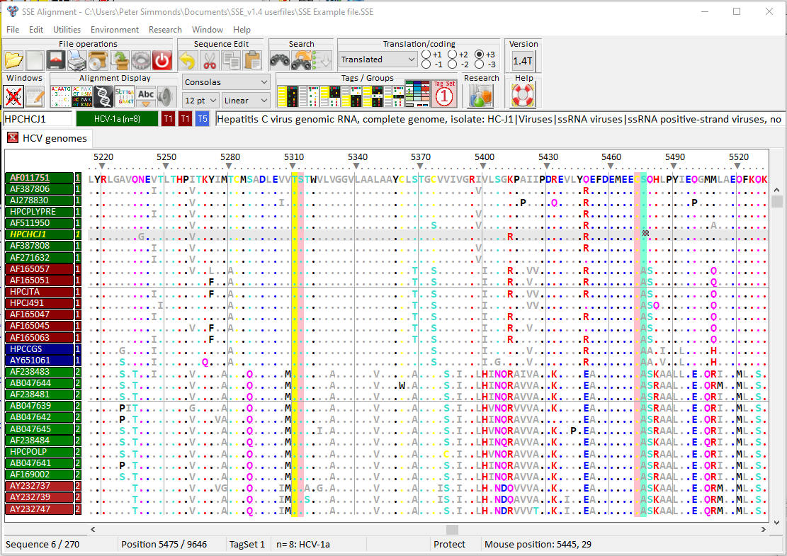

# Program Description
Genomics-based bioinformatics and evolutionary analysis are an increasingly important component of biology. Bioinformatic tools to organise and analyse the rapidly growing amount of nucleotide and amino acid sequence data in organisms ranging from viruses to eukaryotes. SSE provides an integrated environment where sequences can be aligned, annotated, classified and directly analysed by a number of built-in bioinformatic programs. SSE incorporates a sequence editor for the creation of sequence alignments, a process assisted by integrated CLUSTAL / MUSCLE alignment programs and automated removal of indels.

Sequences can be fully annotated, aligned and coding regions identified. Genes can be extracted using GenBank / EMBL annotations, gene boundaries marked and sequences classified into groups. The program provides access to analytical methods that compute diversity, nucleotide and dinucleotide composition, codon usage, recombination and RNA secondary structure. Methods for analysing sequence diversity include measures of divergence and evolutionary distances, identity plots to detect regions of nucleotide or amino acid homology, reconstruction of sequence changes, mono-, di- and higher order nucleotide compositional biases and codon usage.

Association Index calculations, GroupScans, Bootscanning and TreeOrder scans perform phylogenetic analyses that reconcile group membership with tree branching orders and provide powerful methods for examining segregation of alleles and detection of recombination events.

Folding energy scan, StructureDist. RNA secondary and tertiary structures play important roles in gene expression and RNA virus replication. For the latter, persistence of infection is additionally associated with pervasive RNA secondary structure throughout viral genomic RNA that modulates interactions with innate cell defences. SSE provides several programs to scan alignments for RNA secondary structure through folding energy thermodynamic calculations and phylogenetic methods (detection of co-variant changes, and structure conservation between divergent sequences). This includes larger scale visualisation methods for structure conservation in alignments of gene or virus genome sequences.

These analyses complement methods based on detection of sequence constraints, such as suppression of synonymous site variability.

For each program, results can be plotted in real time during analysis through an integrated graphics package, providing publication quality graphs. Results can be also directed to tabulated datafiles for import into spreadsheet or database programs for further analysis.

# Program Download
SSE is freely available for research use. SSE runs under the following operating systems: Windows XP, Vista, 7, 8 and 10 and on Macs running WINE or other virtualisation environments (VMware or parallels) for Windows.

To download SSE please provide the following registration details. These details will only be used to inform you of updates to SSE.

Upon registration our server will display (and send by email) a unique URL from which SSE can be downloaded.

# A note on previous versions

SSE version 1.4 is an upgrade of previous versions (1.1, 1.2, 1.3) of SSE. The program has a large number of additional analysis options and has undergone considerable further testing and sorting out of several minor bugs and inconsistencies. If you have a previously installed version please ensure you have removed it using the uninstaller program before you install version 1.4.

# Program Manual

See [program manual](https://github.com/psimmond/SSE/blob/master/docs/SSE_Helpfile_v1.4.pdf) in docs/ for a full description of the editor and linked analysis functions. 

# Published Description

Simmonds, P. (2012). SSE: A nucleotide and amino acid sequence analysis platform. BMC Research Notes ([Epub Jan.20, 2012](http://www.ncbi.nlm.nih.gov/pubmed/22264264)). 

For other references from the Simmonds group, please refer to PubMed.

# License Conditions
Copyright © 1997-2024 Peter Simmonds, University of Oxford. All rights reserved.

The SSE package is provided "as-is," without any express or implied warranty. In no event shall the author or the University be held liable for any damages arising from the use or misuse of this Software.

Permission is granted to academic users only (“Users”) to download and use the Software for the sole purposes of or internal, non-commercial, non-profit educational and research. The User may not translate, reverse engineer, decompile, disassemble, modify or create derivative works based on Software. The User is prohibited from re-distributing this software without permission from the author. The Software must under no circumstance be re-distributed commercially or for profit.

To request use for non-academic (eg. commercial) purposes or other than those listed above, please contact the author.

Author:

Peter Simmonds

University of Oxford